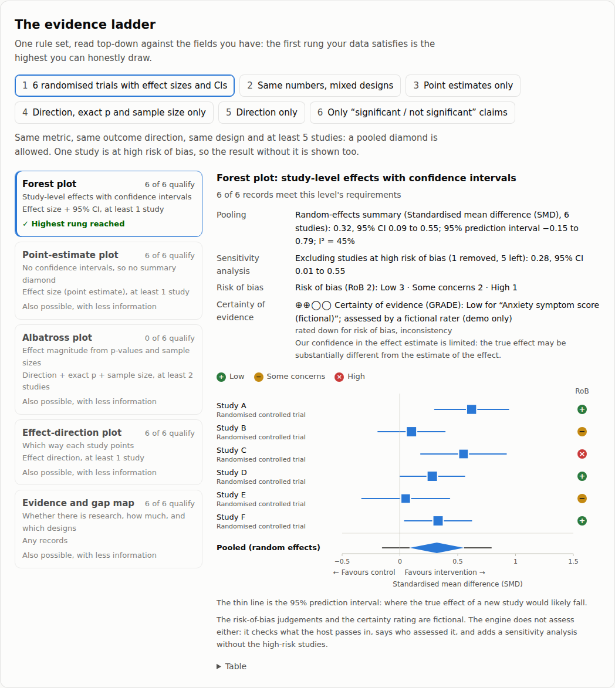
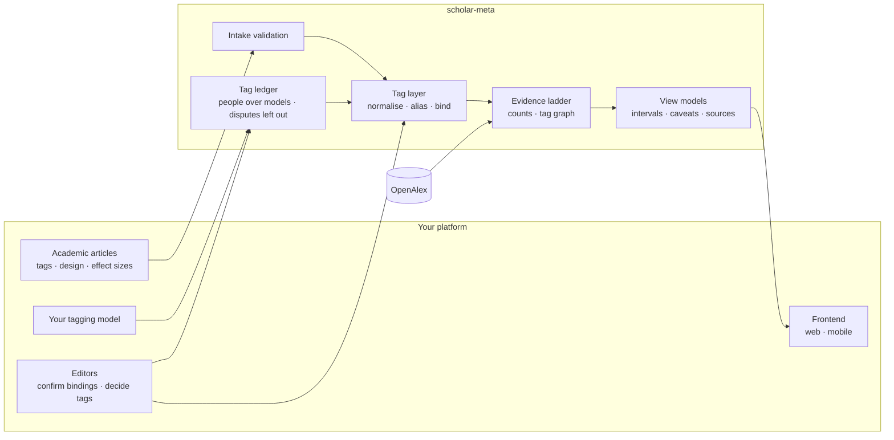
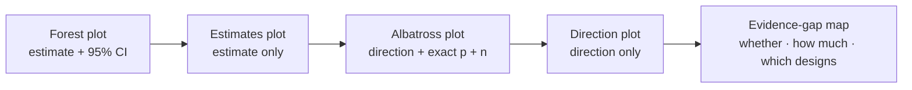

<div align="center">

# scholar-meta

**Draw research evidence only as far as the data truthfully supports.**

A research-evidence visualization engine for platforms that publish academic articles with tags

[](https://github.com/sairaisaika/scholar-meta-visulization/actions/workflows/check.yml)


[中文](README.md) · English · [Live demo](https://sairaisaika.github.io/scholar-meta-visulization/)

</div>

---

## Live demo

**[Open the demo →](https://sairaisaika.github.io/scholar-meta-visulization/)**　Nothing to install — the engine runs in your browser. Pick a set of studies to see which rung of the evidence ladder
it reaches and why not a higher one; drill down from a domain to the articles to see what each level contains, where the articles were published, whether they are free to read, what kind of study each one is, how they cite each other and **why** (using a method, building on it, agreeing or disagreeing), and flip the "reviewed articles only" gate;
change the shape of the counts to see which charts can be drawn and what the others are missing. The data is fictional and the page makes no network requests; what data each section uses is listed under "① Where the data comes from" below.

[](https://sairaisaika.github.io/scholar-meta-visulization/)

[](https://sairaisaika.github.io/scholar-meta-visulization/)

## How it works

A reader opens a tag and sees related research from your own articles and from an external index (OpenAlex). **The data decides which chart is honest**; charts that cannot be drawn say what is missing, and every number carries its denominator, interval and source.
The pipeline has four steps: ① where the data comes from → ② how tagging works → ③ how the numbers are made → ④ how the chart is chosen.



### ① Where the data comes from

| Data | Source | What it carries |
|---|---|---|
| On-site articles | Your article table, public articles only (`listArticles`) | Title and the author's tags; optionally study design, effect size with 95% CI, exact p, sample size, direction, references (optionally saying why each is cited), review time |
| External works | OpenAlex (CC0), called from the server only (`createOpenAlexSource`) | The topic tree (domain → field → subfield → topic) with work counts; the 25 most-cited works per node as examples (journal, free-to-read status, topics, citations among them); full counts by dimension (year, institution type, country, language, open access…). **No effect sizes** |
| Editors' decisions | Stored by you, read by the engine | Which external topic a tag maps to (confirmed / rejected), tag-ledger decisions, the review gate; risk-of-bias and certainty ratings (always with who rated them) |
| Tagging model (optional) | Your own model (`EvidenceTagger`) | Suggested tags per article with confidence and model version; they go to the ledger first, not straight into counts |

**Data used by the demo**: the page makes no network requests, and every name, number, journal and link is made up; but every number, chart and sentence on it is computed by the engine's real code, the same source as the installable package.

| Demo section | Data | Engine code it runs through |
|---|---|---|
| Evidence ladder | [`demo/src/fixtures.ts`](demo/src/fixtures.ts): six made-up sets of study records, each carrying different fields (with or without intervals, exact p, sample size, direction…) | `pickEvidenceView`, `poolEvidence`, `presentView` |
| Drill-down | [`demo/src/explore-data.ts`](demo/src/explore-data.ts): a made-up taxonomy, 10 made-up external works (standing in for OpenAlex) and 6 made-up on-site articles (tags, study design, references with citation purposes, review time); an editor has bound 3 of the tags to one topic | The real service layer `createEvidenceService`, with only the external source swapped for this in-memory tree |
| Chart menu | No study data, only the "shape of the counts" you set on the page | `chartAvailabilityFor`, `presentChartMenu` |

### ② How tagging works

1. **Authors tag articles** in free text. You can also plug in your own model to suggest tags; suggestions go to the [tag ledger](docs/tagging.md) first, where people outrank models and a disagreement within one level is marked "disputed" and left out of counts.
2. **Normalise** (`normalizeTag`): full-width to half-width, strip `#`, lower-case, fold spaces and hyphens into one space. `#CBT-I`, `cbt-i` and `ＣＢＴ－Ｉ` are the same key, `cbt i`. No translation, no merging of synonyms: `焦虑` and `anxiety` stay two tags.
3. **Alias groups** (`groupTags`): spellings of the same key form one group, shown under the most used spelling.
4. **Bind to an external topic** (`resolveTagBinding`): editor-confirmed > editor-rejected > machine match by name. The machine only compares names: a same-name candidate is `exact`, otherwise the first candidate is taken as `first_hit`, and the chart always says "matched automatically, not confirmed". Only a bound tag gets external works.
5. **Review gate** (optional, setting `onsite.reviewGate`): when on, only articles with a review time (for example, commented on by a verified expert) count towards tags and the map; the others stay published, and the page says how many are waiting.

Details and references: [docs/tags.md](docs/tags.md).

### ③ How the numbers are made

Taking a reader who opens the tag `#ADHD` (`getTagMap('ADHD')`):

1. **Validate**: take the public on-site articles with this tag and run each through `intakeArticle`. Inverted intervals, intervals that miss their estimate and directions that contradict the effect are cleared, and the list of problems can go straight back to the author.
2. **Ask the external source**: through the binding, fetch the topic's parent, siblings and counts, then the 25 most-cited works. Results are cached for 7–30 days; a failed request returns `null`, is never cached, and never reads as "no research".
3. **Link** (`buildRecordEdges`): a DOI in an article's references that matches a record in this batch becomes a citation edge, carrying the purpose the author stated; two on-site articles sharing another tag get a shared-tag edge (co-occurrence, not citation).
4. **Count** (a separate route, `/counts`): external works are grouped by dimension, each dimension declaring its own denominator; on-site articles are counted by year, publication type, study design, co-occurring tags and self-reported result.
5. **Proportions** use only the declared denominator and carry a Wilson 95% interval; below 30, only counts are shown.

### ④ How the chart is chosen

Two separate decisions.

**Records: the evidence ladder** (`pickEvidenceView`). Look at which fields each study carries and take the strongest level they support:



| The studies have | Drawn as | Also |
|---|---|---|
| Effect size + 95% CI | Forest plot | Same metric, same outcome direction, same design, every study with an interval, at least 5 studies ⇒ a pooled diamond (REML + HKSJ random effects, with a prediction interval) |
| Effect size only | Estimates plot | No intervals, no pooling |
| Direction + exact p + sample size | Albatross plot | Effect magnitude read from p and n |
| Direction only | Effect-direction plot | Counted by direction, never by significance |
| Only "significant / not significant", or nothing | Evidence-gap map | Answers whether, how much and which designs only |

External works carry no effect sizes, so forest plots rely on numbers declared by on-site authors. Vote counting by significance is never a level, and citation counts never go on an effect axis (Cochrane Handbook v6.5 ch.10 / ch.12, SWiM).

**Counts: the chart menu** (`chartAvailabilityFor`). Only the shape of the counts matters: are buckets exclusive, how many have values, is it a year, is there a cross-tab or an overlap count, are there at least 30 on-site articles. From that it decides which of 14 charts (bar, time series, waffle, treemap, pie, UpSet, Lorenz, evidence-gap map…) can be drawn; the rest stay greyed out and say what is missing. What each chart answers and does not answer: [docs/charts.md](docs/charts.md).

**Last: view models** (`present*`). They turn the data into something ready to draw: text in Chinese and English, proportions with intervals, caveats and source footnotes are all computed; your React, Vue, plain DOM or mobile components only lay them out.

## Guarantees

| Rule | How the engine enforces it |
|---|---|
| Every tag→topic link has provenance | curated / rejected / machine-matched bindings, printed on the chart |
| Shares use the declared denominator only | computed in the view models with Wilson intervals; counts only below n = 30 |
| Charts that can't be drawn stay visible | 14 chart kinds, each greyed out with the missing field named |
| A failure is not "no research" | external failures return `null`; failures are never cached |
| On-site and external data never share an axis | separate layers, each with its own denominator and caveats |
| Author-declared numbers are validated first | inverted or inconsistent intervals and contradicting directions are caught and reported |
| The engine never rates risk of bias or certainty itself | editors or external reviews pass judgements in, always saying who assessed them; each study is marked on the chart (not assessed is never treated as low risk), and pooling adds a sensitivity analysis without high-risk studies |
| Entering the tag system can require a review | with the review gate on, only articles the site marks as reviewed (for example, commented on by a verified expert) count; the site decides who is an expert, and unreviewed articles stay published while the page says how many are waiting |
| Who decides a tag follows rules | tagging models are pluggable and their output is validated; people outrank models; disagreement within the deciding tier is marked disputed and left out of counts; overturning a higher tier needs a change request, which takes effect once accepted |

Method and references: [docs/tags.md](docs/tags.md) (Chinese).

## Quick start

```bash
# Prebuilt package attached to every GitHub release (works the same with npm and yarn)
pnpm add https://github.com/sairaisaika/scholar-meta-visulization/releases/download/v0.5.0/scholar-meta-0.5.0.tgz
```

All versions are on [Releases](https://github.com/sairaisaika/scholar-meta-visulization/releases); changes are in the [CHANGELOG](CHANGELOG.md).

```ts
// Server: one function wires the chain, plus a web-standard route
import { createEvidenceService } from 'scholar-meta/service'
import { createOpenAlexSource } from 'scholar-meta/openalex'
import { createEvidenceHandler } from 'scholar-meta/http'

const evidence = createEvidenceService({
  onsite: { listArticles: ({ tagKeys }) => db.publicArticles({ tagKeys }) },
  external: createOpenAlexSource({ apiKey: () => process.env.OPENALEX_API_KEY, dailyCreditBudget: 5000 }),
})
export const GET = createEvidenceHandler(evidence, { basePath: '/api/evidence' })
```

```ts
// Frontend (web / React Native): fetch → view model → draw
import { createEvidenceClient } from 'scholar-meta/client'
import { presentEvidenceMap } from 'scholar-meta'

const map = await createEvidenceClient().getTagMap('ADHD')
const view = map ? presentEvidenceMap(map, { locale: 'en' }) : null   // null = unavailable, don't draw an empty chart
```

## Entry points

| Entry | Runs on | Provides |
|---|---|---|
| `scholar-meta` | anywhere | contract types, judgments, tag layer, intake, tagging-model port and tag ledger, plugin settings, view models, zh/en messages |
| `scholar-meta/client` | browser · mobile | typed client for your own API |
| `scholar-meta/service` | server | facade and ports: articles, bindings, cache, external source |
| `scholar-meta/http` | server | `Request → Response` handler with four GET routes |
| `scholar-meta/openalex` | server | OpenAlex adapter: candidates, four-level zoom (same-parent siblings with counts), one level in, journals and free-to-read links of works, full counts, daily budget |

**Conventions integrators can rely on** (any change is announced in the CHANGELOG first)

| Convention | Detail |
|---|---|
| Additive contract | breaking changes only with a minor version bump, listed under "破坏性（BREAKING）" in the CHANGELOG |
| `src/` has no dependencies and no I/O | network calls only in `openalex.ts` and `client.ts`, both with injectable `fetch`; no `node:*`, no `process`; compiles under stricter compiler options (`pnpm typecheck:src`) |
| Siblings sorted by size | zoom-bundle siblings are ordered by `works_count`, largest first, missing counts last |
| Filters keep sources | `applyEvidenceFilters` keeps `sources` unchanged when showing on-site records only |
| Cost figures | any change to the cost figures under "Quota" is noted in the CHANGELOG |

<details>
<summary><b>Quota, privacy and known limits</b></summary>

- **External sources are called server-side only**: a browser talking to a third party leaks who cares about which topic along with an IP. Browser entries contain no outbound-network code, in the import graph or in the built bundles (gated).
- **Abuse guard**: by default only tags that appear in public articles are sent to external sources; `dailyCreditBudget` caps daily spend.
- **Cost** (measured 2026-09-28): autocomplete and topic entities are free; upper-level entities and any list cost 1 credit (per page); a tag page costs about 2 credits cold; a node's full counts about 17.
- **Limits**: OpenAlex is the only external source so far; external works carry no effect sizes, so forest plots rely on author-declared effects; "which journals a node's works appear in" is counted in the sample only, not as a full distribution (the source's grouping returns only the top 200 sources).
- **Verified live**: every request shape the adapter sends is checked against the real API by the `live` workflow (runs whenever the adapter changes; all passed on 2026-10-02); locally `OPENALEX_LIVE=1 pnpm jest test/openalex.live.test.ts`.

</details>

## Docs

[Tag method](docs/tags.md) · [Tagging and the ledger](docs/tagging.md) · [Architecture](docs/architecture.md) · [Integration](docs/integration.md) · [Chart kinds](docs/charts.md) · [Contributing](CONTRIBUTING.md) · [Changelog](CHANGELOG.md) — detailed docs are in Chinese.

## Development

```bash
pnpm install
pnpm check      # types · boundary gate · private-terms gate · tests · build and dist gate · demo page
pnpm demo       # build only the demo page: demo/dist/index.html, open it in a browser
```

## License

Code is [MIT](LICENSE). OpenAlex data is CC0; on-site article licences are declared by the integrating platform (`onsiteLicense`) and printed in footnotes.
