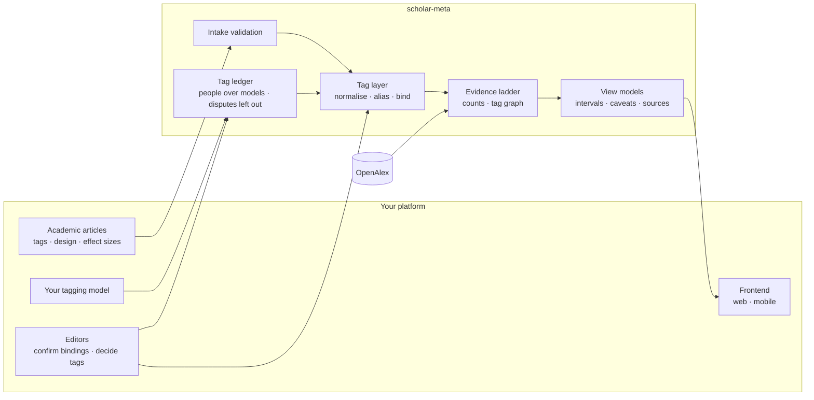
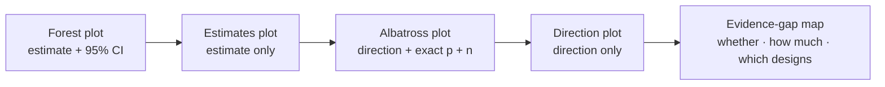

<div align="center">

# scholar-meta

**Draw research evidence only as far as the data truthfully supports.**

A research-evidence visualization engine for platforms that publish academic articles with tags

[](https://github.com/sairaisaika/scholar-meta-visulization/actions/workflows/check.yml)


[中文](README.md) · English · [Live demo](https://sairaisaika.github.io/scholar-meta-visulization/)

</div>

---

## What it does

A reader opens a tag and sees related research from your own articles and from an external index (OpenAlex). **The data decides which chart is honest**; charts that cannot be drawn say what is missing, and every number carries its denominator, interval and source.



## The evidence ladder



The engine picks the **strongest level** the records support and says why not the stronger one (Cochrane Handbook v6.5 ch.10 / ch.12, SWiM).
Vote counting by significance is never a level; citation counts never go on an effect axis. When pooling is allowed, it reports a REML + HKSJ random-effects estimate with a prediction interval.

## Guarantees

| Rule | How the engine enforces it |
|---|---|
| Every tag→topic link has provenance | curated / rejected / machine-matched bindings, printed on the chart |
| Shares use the declared denominator only | computed in the view models with Wilson intervals; counts only below n = 30 |
| Charts that can't be drawn stay visible | 14 chart kinds, each greyed out with the missing field named |
| A failure is not "no research" | external failures return `null`; failures are never cached |
| On-site and external data never share an axis | separate layers, each with its own denominator and caveats |
| Author-declared numbers are validated first | inverted or inconsistent intervals and contradicting directions are caught and reported |
| The engine never rates risk of bias or certainty itself | editors or external reviews pass judgements in, always saying who assessed them; each study is marked on the chart (not assessed is never treated as low risk), and pooling adds a sensitivity analysis without high-risk studies |
| Who decides a tag follows rules | tagging models are pluggable and their output is validated; people outrank models; disagreement within the deciding tier is marked disputed and left out of counts; overturning a higher tier needs a change request, which takes effect once accepted |

Method and references: [docs/tags.md](docs/tags.md) (Chinese).

## Quick start

```bash
# Prebuilt package attached to every GitHub release (works the same with npm and yarn)
pnpm add https://github.com/sairaisaika/scholar-meta-visulization/releases/download/v0.3.0/scholar-meta-0.3.0.tgz
```

All versions are on [Releases](https://github.com/sairaisaika/scholar-meta-visulization/releases); changes are in the [CHANGELOG](CHANGELOG.md).

```ts
// Server: one function wires the chain, plus a web-standard route
import { createEvidenceService } from 'scholar-meta/service'
import { createOpenAlexSource } from 'scholar-meta/openalex'
import { createEvidenceHandler } from 'scholar-meta/http'

const evidence = createEvidenceService({
  onsite: { listArticles: ({ tagKeys }) => db.publicArticles({ tagKeys }) },
  external: createOpenAlexSource({ apiKey: () => process.env.OPENALEX_API_KEY, dailyCreditBudget: 5000 }),
})
export const GET = createEvidenceHandler(evidence, { basePath: '/api/evidence' })
```

```ts
// Frontend (web / React Native): fetch → view model → draw
import { createEvidenceClient } from 'scholar-meta/client'
import { presentEvidenceMap } from 'scholar-meta'

const map = await createEvidenceClient().getTagMap('ADHD')
const view = map ? presentEvidenceMap(map, { locale: 'en' }) : null   // null = unavailable, don't draw an empty chart
```

## Entry points

| Entry | Runs on | Provides |
|---|---|---|
| `scholar-meta` | anywhere | contract types, judgments, tag layer, intake, tagging-model port and tag ledger, plugin settings, view models, zh/en messages |
| `scholar-meta/client` | browser · mobile | typed client for your own API |
| `scholar-meta/service` | server | facade and ports: articles, bindings, cache, external source |
| `scholar-meta/http` | server | `Request → Response` handler with four GET routes |
| `scholar-meta/openalex` | server | OpenAlex adapter: candidates, four-level zoom (same-parent siblings with counts), full counts, daily budget |

**Conventions integrators can rely on** (any change is announced in the CHANGELOG first)

| Convention | Detail |
|---|---|
| Additive contract | breaking changes only with a minor version bump, listed under "破坏性（BREAKING）" in the CHANGELOG |
| `src/` has no dependencies and no I/O | network calls only in `openalex.ts` and `client.ts`, both with injectable `fetch`; no `node:*`, no `process`; compiles under stricter compiler options (`pnpm typecheck:src`) |
| Siblings sorted by size | zoom-bundle siblings are ordered by `works_count`, largest first, missing counts last |
| Filters keep sources | `applyEvidenceFilters` keeps `sources` unchanged when showing on-site records only |
| Cost figures | any change to the cost figures under "Quota" is noted in the CHANGELOG |

<details>
<summary><b>Quota, privacy and known limits</b></summary>

- **External sources are called server-side only**: a browser talking to a third party leaks who cares about which topic along with an IP. Browser entries contain no outbound-network code, in the import graph or in the built bundles (gated).
- **Abuse guard**: by default only tags that appear in public articles are sent to external sources; `dailyCreditBudget` caps daily spend.
- **Cost** (measured 2026-09-28): autocomplete and topic entities are free; upper-level entities and any list cost 1 credit (per page); a tag page costs about 2 credits cold; a node's full counts about 17.
- **Limits**: OpenAlex is the only external source so far; external works carry no effect sizes, so forest plots rely on author-declared effects; the subfield / field / domain entity shapes and the DOI batch lookup are not yet verified against the live API (`OPENALEX_LIVE=1 pnpm jest test/openalex.live.test.ts`).

</details>

## Docs

[Tag method](docs/tags.md) · [Tagging and the ledger](docs/tagging.md) · [Architecture](docs/architecture.md) · [Integration](docs/integration.md) · [Chart kinds](docs/charts.md) · [Contributing](CONTRIBUTING.md) · [Changelog](CHANGELOG.md) — detailed docs are in Chinese.

## Development

```bash
pnpm install
pnpm check      # types · boundary gate · private-terms gate · tests · build and dist gate · demo page
pnpm demo       # build only the demo page: demo/dist/index.html, open it in a browser
```

## License

Code is [MIT](LICENSE). OpenAlex data is CC0; on-site article licences are declared by the integrating platform (`onsiteLicense`) and printed in footnotes.
