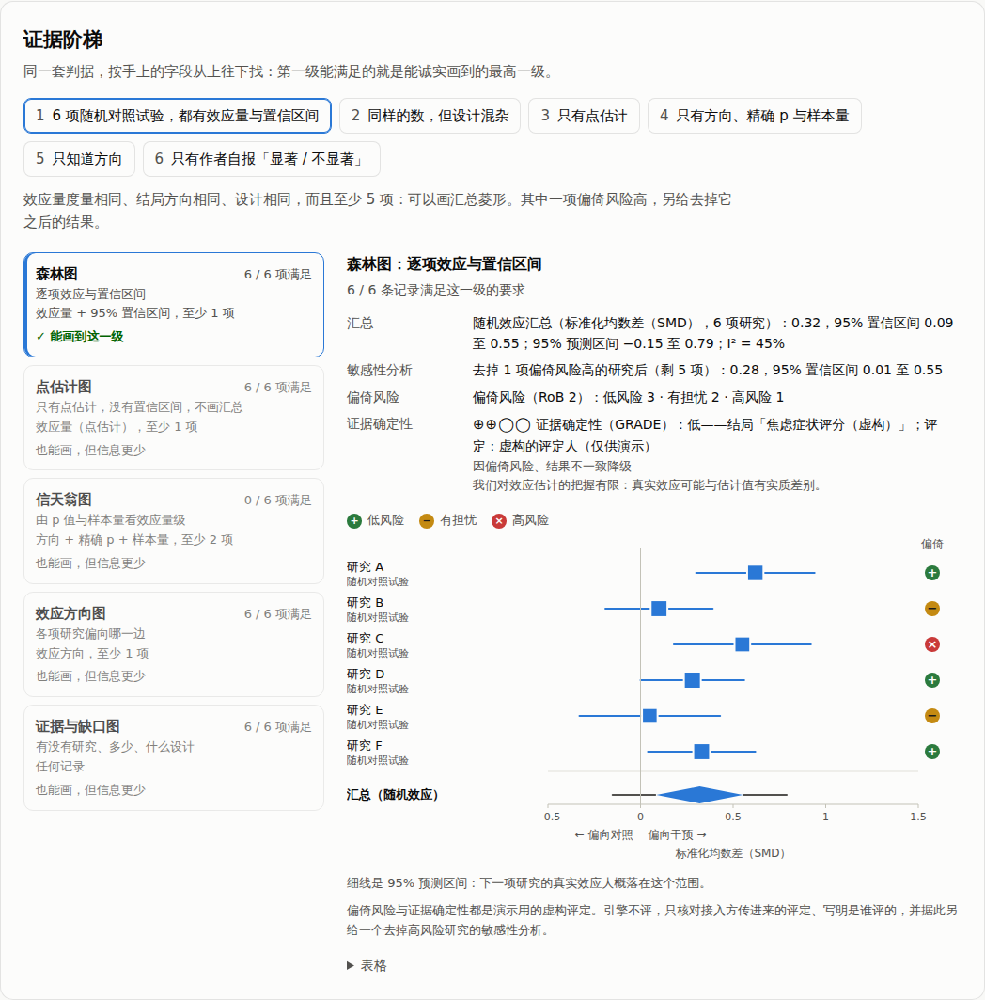
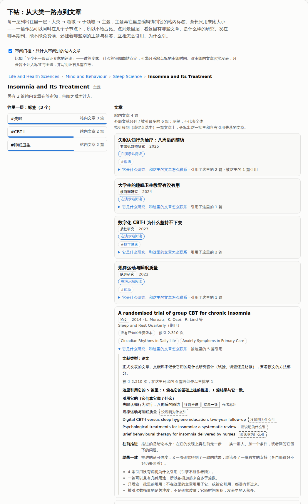
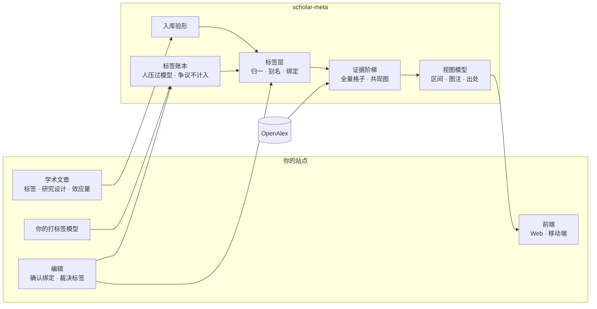
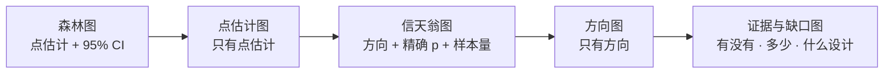

<div align="center">

# scholar-meta

**手上有什么数据，就诚实地画到哪一级。**

给「学术文章 + 标签」内容平台用的研究证据可视化引擎

[](https://github.com/sairaisaika/scholar-meta-visulization/actions/workflows/check.yml)


中文 · [English](README.en.md) · [在线演示](https://sairaisaika.github.io/scholar-meta-visulization/)

</div>

---

## 在线演示

**[打开演示页 →](https://sairaisaika.github.io/scholar-meta-visulization/)**　不用装任何东西，引擎直接在浏览器里跑：换一组研究，看它能画到证据阶梯的哪一级、为什么不是更高一级；
从大类一路点到文章，看每一层往里有什么、文章发在哪本期刊、能不能免费读、是什么样的研究、互相怎么引用、**为什么引**（拿去用了方法、往前推进，还是结果一致或不一致），再拨一下「只计入审阅过的文章」；
拨一拨格子的形状，看哪些图能画、画不了的差什么。数据是虚构的，页面不连网；每一块用的什么数据，见下面「① 数据从哪来」。

[](https://sairaisaika.github.io/scholar-meta-visulization/)

[](https://sairaisaika.github.io/scholar-meta-visulization/)

## 它怎么工作

读者打开一个标签，看到站内文章与外部文献库（OpenAlex）里的相关研究；**图能画到哪一级由数据决定**，画不了的写明差什么，每个数字带分母、区间与出处。
整条链分四步：① 数据从哪来 → ② 怎么打标签 → ③ 怎么出数据 → ④ 怎么出图。



### ① 数据从哪来

| 数据 | 从哪来 | 带什么 |
|---|---|---|
| 站内文章 | 接入方的文章表，只读公开的（`listArticles`） | 标题、作者打的标签；可选：研究设计、效应量与 95% 区间、精确 p、样本量、效应方向、参考文献（可写明为什么引）、审阅时间 |
| 外部文献 | OpenAlex（CC0），只在服务端调用（`createOpenAlexSource`） | 主题树（大类 → 领域 → 子领域 → 主题）与各级篇数；每个节点被引最多的 25 篇示例（期刊、能不能免费读、主题、互相引用）；按维度的全量计数（年份、机构类型、国家、语言、开放获取……）。**不带效应量** |
| 编辑的决定 | 接入方后台存，引擎只读 | 标签配哪个外部主题（确认 / 否决）、标签账本的裁决、审阅门槛的开关；偏倚风险与证据确定性的评定（写明谁评的） |
| 打标签模型（可选） | 接入方自己的模型（`EvidenceTagger`） | 每篇文章的候选标签、置信度、模型版本；先进账本，不直接进统计 |

**演示页用的数据**：页面不连网，所有名字、数字、期刊和链接都是编的；但页面上的每个数、每张图、每句话都由引擎真正的代码算出来，与安装包是同一份源码。

| 演示页的区块 | 数据 | 经过的引擎代码 |
|---|---|---|
| 证据阶梯 | [`demo/src/fixtures.ts`](demo/src/fixtures.ts)：6 组编好的研究记录，每组带的字段不同（有没有区间、精确 p、样本量、方向……） | `pickEvidenceView`、`poolEvidence`、`presentView` |
| 下钻 | [`demo/src/explore-data.ts`](demo/src/explore-data.ts)：一棵编的分类树、10 篇编的外部论文（代替 OpenAlex）、6 篇编的站内文章（标签、研究设计、参考文献与引用用途、审阅时间）；编辑把其中 3 个标签绑到了一个主题 | 真正的服务层 `createEvidenceService`，只把外部源换成内存里的这棵树 |
| 图种菜单 | 没有研究数据，只有你在页面上拨的「格子形状」 | `chartAvailabilityFor`、`presentChartMenu` |

### ② 怎么打标签

1. **作者打标签**：自由文本，怎么写都行。接入方也可以接自己的模型给建议；建议先进[标签账本](docs/tagging.md)，人压过模型，同一级意见不一致就标「有争议」，不计入。
2. **归一**（`normalizeTag`）：全角转半角、去 `#`、转小写、空白与连字符折成一个空格。`#CBT-I`、`cbt-i`、`ＣＢＴ－Ｉ` 都是同一个键 `cbt i`。不翻译、不合并同义词：`焦虑` 和 `anxiety` 是两个标签。
3. **别名组**（`groupTags`）：同一个键的不同写法归成一组，显示名取用得最多的那种写法。
4. **配外部主题**（`resolveTagBinding`）：编辑确认 > 编辑否决 > 机器按名字匹配。机器只比名字：同名记 `exact`，否则取第一条候选记 `first_hit`，图上永远印「自动匹配，未经确认」。配上了，标签页才有外部文献。
5. **审阅门槛**（可选，设置 `onsite.reviewGate`）：开了以后，只有标了审阅时间的文章（比如有认证专家评论过）计入标签与图谱；没审阅的照常发表，页面写明还有几篇在等。

细节与依据见 [docs/tags.md](docs/tags.md)。

### ③ 怎么出数据

以读者打开标签 `#ADHD` 为例（`getTagMap('ADHD')`）：

1. **验形**：取带这个标签的公开站内文章，逐篇过 `intakeArticle`。写反的区间、不含点估计的区间、与效应量矛盾的方向会被清掉，问题清单可以原样回给作者。
2. **问外部源**：按绑定取这个主题的上级、兄弟与篇数，再取被引最多的 25 篇示例。结果缓存 7–30 天；没问成回 `null`，不缓存，也不说「没有研究」。
3. **连边**（`buildRecordEdges`）：站内文章参考文献里的 DOI 对上这批里的记录，就连一条引用边，带上作者写明的用途；两篇站内文章还共有别的标签，就连一条同标签边（共现，不是引用）。
4. **计数**（另一个读口 `/counts`）：外部文献按维度分组计数，每一维声明自己的分母；站内文章按年份、文献类型、研究设计、一起出现的标签、自报结果计数。
5. **算比例**：百分比只用声明的分母，带 Wilson 95% 区间；分母不到 30 只给篇数。

### ④ 怎么出图

两件事分开判。

**记录级：证据阶梯**（`pickEvidenceView`）。看每项研究带了哪些字段，从强到弱，找第一级能满足的：



| 研究里有 | 画成 | 另外 |
|---|---|---|
| 效应量 + 95% 置信区间 | 森林图 | 同一度量、同一结局方向、同一设计、每项有区间、至少 5 项 ⇒ 加汇总菱形（REML + HKSJ 随机效应，带预测区间） |
| 只有效应量 | 点估计图 | 不画区间，不汇总 |
| 方向 + 精确 p + 样本量 | 信天翁图 | 从 p 与样本量看效应的量级 |
| 只有方向 | 效应方向图 | 按方向计数，不按显著性计数 |
| 只有「显著 / 不显著」，或什么都没有 | 证据与缺口图 | 只回答有没有、多少、什么设计 |

外部文献不带效应量，所以森林图靠站内作者申报的数字。按「显著 / 不显著」计票不构成任何一级，被引数永远不上效应量轴（Cochrane Handbook v6.5 ch.10 / ch.12、SWiM）。

**计数级：图种菜单**（`chartAvailabilityFor`）。只看格子的形状：桶互斥吗、有几个有值的桶、是不是年份、有没有两维交叉表或重叠计数、站内篇数够不够 30。据此判 14 种图（条形、时间序列、华夫、树图、饼、UpSet、洛伦兹、证据与缺口图……）能不能画；画不了的灰着，写明差什么。每种图答什么、不答什么见 [docs/charts.md](docs/charts.md)。

**最后：视图模型**（`present*`）。把数据变成可以直接画的东西：中英文案、百分比与区间、图注、出处脚注都算好；React、Vue、原生 DOM 或移动端组件只管排版。

## 诚实规则

| 规则 | 引擎怎么保证 |
|---|---|
| 标签到主题的对应有出处 | 编辑确认 / 编辑否决 / 机器按名字匹配，三种绑定在图上印出来 |
| 百分比只用声明的分母 | 视图模型里算好，带 Wilson 区间；分母 < 30 只给计数 |
| 画不了的图不藏 | 14 个图种逐个判定，灰着并写明差哪个字段 |
| 失败不等于没有研究 | 外部源失败回 `null`；「没问成」永不缓存 |
| 站内与站外不上同一根轴 | 分层下发，各自声明分母与图注 |
| 作者自报的数字先验形 | 写反的区间、不含点估计的区间、矛盾的方向都会被拦下并告诉作者 |
| 偏倚风险与证据确定性不由引擎评 | 编辑或外部综述评好传进来，必须写明谁评的；图上逐项标出（没评过不当成低风险），汇总另给去掉高风险研究的敏感性分析 |
| 进标签系统可以要求先审阅 | 站点开了审阅门槛，只有标了审阅时间的文章（比如有认证专家评论过）计入；谁算专家由站点定，没审阅的照常发表、写明还有几篇在等 |
| 标签由谁定有规则 | 模型可以换，输出一律验形；人压过模型，同级分歧标为「有争议」且不计入；推翻上一级要走修改申请，审核通过即生效 |

方法与参考文献见 [docs/tags.md](docs/tags.md)。

## 快速开始

```bash
# 编译好的安装包，挂在每个 GitHub release 上（npm、yarn 同样用这个链接）
pnpm add https://github.com/sairaisaika/scholar-meta-visulization/releases/download/v0.5.0/scholar-meta-0.5.0.tgz
```

各版本见 [Releases](https://github.com/sairaisaika/scholar-meta-visulization/releases)，改动见 [CHANGELOG](CHANGELOG.md)。

```ts
// 服务端：一个函数装起整条链，再挂一个 Web 标准路由
import { createEvidenceService } from 'scholar-meta/service'
import { createOpenAlexSource } from 'scholar-meta/openalex'
import { createEvidenceHandler } from 'scholar-meta/http'

const evidence = createEvidenceService({
  onsite: { listArticles: ({ tagKeys }) => db.publicArticles({ tagKeys }) },
  external: createOpenAlexSource({ apiKey: () => process.env.OPENALEX_API_KEY, dailyCreditBudget: 5000 }),
})
export const GET = createEvidenceHandler(evidence, { basePath: '/api/evidence' })
```

```ts
// 前端（Web / React Native）：取数据 → 视图模型 → 画
import { createEvidenceClient } from 'scholar-meta/client'
import { presentEvidenceMap } from 'scholar-meta'

const map = await createEvidenceClient().getTagMap('ADHD')
const view = map ? presentEvidenceMap(map, { locale: 'zh' }) : null   // null ＝ 暂时取不到，别画空图
```

## 入口

| 入口 | 在哪跑 | 做什么 |
|---|---|---|
| `scholar-meta` | 任何地方 | 契约类型、判据、标签层、入库验形、打标签模型端口与标签账本、插件设置、视图模型、中英词典 |
| `scholar-meta/client` | 浏览器 · 移动端 | 类型化读口客户端，只打你自己的 API |
| `scholar-meta/service` | 服务端 | 门面与端口：文章源、绑定表、缓存、外部源 |
| `scholar-meta/http` | 服务端 | `Request → Response` 读口，四个 GET 路由 |
| `scholar-meta/openalex` | 服务端 | OpenAlex 适配器：候选主题、四级缩放（同父兄弟带篇数）、往里一层、作品的期刊与免费链接、全量计数、每日额度 |

**给接入方的约定**（改之前先在 CHANGELOG 说明）

| 约定 | 内容 |
|---|---|
| 契约只做加法 | 破坏性改动只随次版本号发生，写在 CHANGELOG 的「破坏性（BREAKING）」一节 |
| `src/` 零依赖、零 IO | 出网只在 `openalex.ts` 与 `client.ts`，`fetch` 都可注入；不引 `node:*`、`process`；较严的编译选项下也能编译（`pnpm typecheck:src`） |
| 兄弟按篇数排 | 缩放包的兄弟按 `works_count` 从多到少，没有篇数的排最后 |
| 筛选不动出处 | `applyEvidenceFilters` 只看站内时，`sources` 原样保留 |
| 成本口径 | 下面「额度」里的成本数字变了，CHANGELOG 写明 |

<details>
<summary><b>额度、隐私与已知限制</b></summary>

- **只在服务端调外部源**：浏览器直连第三方会把「谁在关心什么」连同 IP 交出去；浏览器入口的依赖图与打包产物里都没有出网代码（闸会查）。
- **防滥用**：缺省只对公开文章里出现过的标签去问外部源；`dailyCreditBudget` 封住每日花费。
- **成本**（2026-09-28 实测）：自动补全与主题实体 0 credit；上级三级实体与任何列表各 1 credit（翻页每页 1）；标签页冷启动约 2 credit；一个节点的全量格子约 17 credit。
- **限制**：外部源目前只有 OpenAlex；外部文献本身不带效应量，森林图靠站内作者申报；「这个节点的论文都发在哪些期刊」只在示例里数，全量分布暂不提供（外部源的分组只回前 200 个来源）。
- **实测**：适配器的每一种请求形状都由 `live` 工作流对真实 API 核对（改了适配器就跑；2026-10-02 全部通过）；本机 `OPENALEX_LIVE=1 pnpm jest test/openalex.live.test.ts`。

</details>

## 文档

[标签方法](docs/tags.md) · [打标签与账本](docs/tagging.md) · [架构](docs/architecture.md) · [接入指南](docs/integration.md) · [图种](docs/charts.md) · [贡献规则](CONTRIBUTING.md) · [变更记录](CHANGELOG.md)

## 开发

```bash
pnpm install
pnpm check      # 类型 · 边界闸 · 私有词闸 · 测试 · 打包与产物闸 · 演示页
pnpm demo       # 只构建演示页：demo/dist/index.html，浏览器直接打开
```

## 许可

代码采用 [MIT](LICENSE)。OpenAlex 数据为 CC0；站内文章的许可由接入方声明（`onsiteLicense`），脚注逐条印出。
