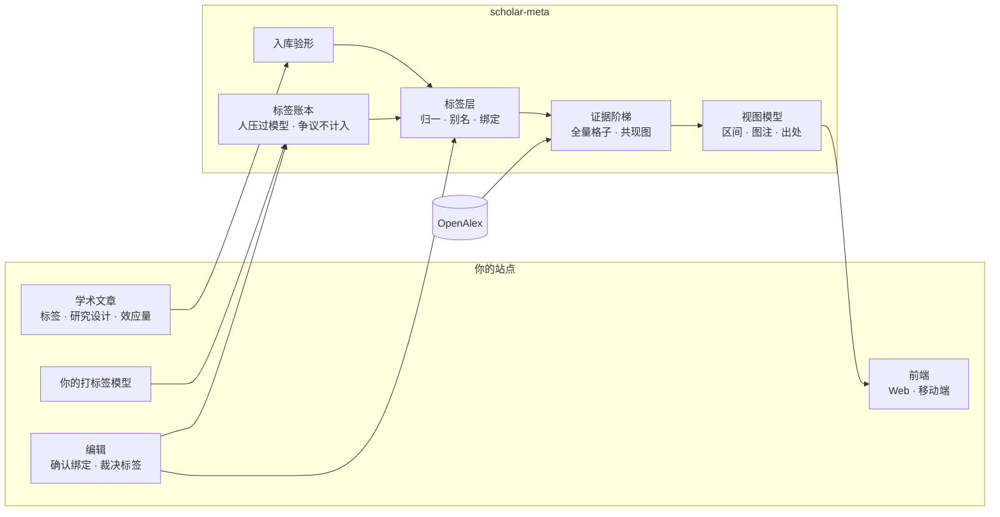
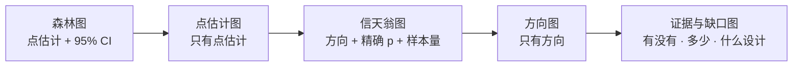

<div align="center">

# scholar-meta

**手上有什么数据，就诚实地画到哪一级。**

给「学术文章 + 标签」内容平台用的研究证据可视化引擎

[](https://github.com/sairaisaika/scholar-meta-visulization/actions/workflows/check.yml)


中文 · [English](README.en.md)

</div>

---

## 它做什么

读者打开一个标签，看到站内文章与外部文献库（OpenAlex）里的相关研究；**图能画到哪一级由数据决定**，画不了的写明差什么，每个数字带分母、区间与出处。



## 证据阶梯



取数据支持的**最强一级**，并说出为什么不是更强的那一级（Cochrane Handbook v6.5 ch.10 / ch.12、SWiM）。
按「显著 / 不显著」计票不构成任何一级；被引数永远不上效应量轴。能汇总时给出 REML + HKSJ 随机效应估计与预测区间。

## 诚实规则

| 规则 | 引擎怎么保证 |
|---|---|
| 标签到主题的对应有出处 | 编辑确认 / 编辑否决 / 机器按名字匹配，三种绑定在图上印出来 |
| 百分比只用声明的分母 | 视图模型里算好，带 Wilson 区间；分母 < 30 只给计数 |
| 画不了的图不藏 | 14 个图种逐个判定，灰着并写明差哪个字段 |
| 失败不等于没有研究 | 外部源失败回 `null`；「没问成」永不缓存 |
| 站内与站外不上同一根轴 | 分层下发，各自声明分母与图注 |
| 作者自报的数字先验形 | 写反的区间、不含点估计的区间、矛盾的方向都会被拦下并告诉作者 |
| 标签由谁定有规则 | 模型可以换，输出一律验形；人压过模型，同级分歧标为「有争议」且不计入；推翻上一级要走修改申请，审核通过即生效 |

方法与参考文献见 [docs/tags.md](docs/tags.md)。

## 快速开始

```bash
pnpm add github:sairaisaika/scholar-meta-visulization   # 尚未发布到 npm；Next.js 需 transpilePackages: ['scholar-meta']
```

```ts
// 服务端：一个函数装起整条链，再挂一个 Web 标准路由
import { createEvidenceService } from 'scholar-meta/service'
import { createOpenAlexSource } from 'scholar-meta/openalex'
import { createEvidenceHandler } from 'scholar-meta/http'

const evidence = createEvidenceService({
  onsite: { listArticles: ({ tagKeys }) => db.publicArticles({ tagKeys }) },
  external: createOpenAlexSource({ apiKey: () => process.env.OPENALEX_API_KEY, dailyCreditBudget: 5000 }),
})
export const GET = createEvidenceHandler(evidence, { basePath: '/api/evidence' })
```

```ts
// 前端（Web / React Native）：取数据 → 视图模型 → 画
import { createEvidenceClient } from 'scholar-meta/client'
import { presentEvidenceMap } from 'scholar-meta'

const map = await createEvidenceClient().getTagMap('ADHD')
const view = map ? presentEvidenceMap(map, { locale: 'zh' }) : null   // null ＝ 暂时取不到，别画空图
```

## 入口

| 入口 | 在哪跑 | 做什么 |
|---|---|---|
| `scholar-meta` | 任何地方 | 契约类型、判据、标签层、入库验形、打标签模型端口与标签账本、插件设置、视图模型、中英词典 |
| `scholar-meta/client` | 浏览器 · 移动端 | 类型化读口客户端，只打你自己的 API |
| `scholar-meta/service` | 服务端 | 门面与端口：文章源、绑定表、缓存、外部源 |
| `scholar-meta/http` | 服务端 | `Request → Response` 读口，四个 GET 路由 |
| `scholar-meta/openalex` | 服务端 | OpenAlex 适配器：候选主题、四级缩放（同父兄弟带篇数）、全量计数、每日额度 |

**给接入方的约定**（改之前先在 CHANGELOG 说明）

| 约定 | 内容 |
|---|---|
| 契约只做加法 | 破坏性改动只随次版本号发生，写在 CHANGELOG 的「破坏性（BREAKING）」一节 |
| `src/` 零依赖、零 IO | 出网只在 `openalex.ts` 与 `client.ts`，`fetch` 都可注入；不引 `node:*`、`process`；较严的编译选项下也能编译（`pnpm typecheck:src`） |
| 兄弟按篇数排 | 缩放包的兄弟按 `works_count` 从多到少，没有篇数的排最后 |
| 筛选不动出处 | `applyEvidenceFilters` 只看站内时，`sources` 原样保留 |
| 成本口径 | 下面「额度」里的成本数字变了，CHANGELOG 写明 |

<details>
<summary><b>额度、隐私与已知限制</b></summary>

- **只在服务端调外部源**：浏览器直连第三方会把「谁在关心什么」连同 IP 交出去；浏览器入口的依赖图与打包产物里都没有出网代码（闸会查）。
- **防滥用**：缺省只对公开文章里出现过的标签去问外部源；`dailyCreditBudget` 封住每日花费。
- **成本**（2026-09-28 实测）：自动补全与主题实体 0 credit；上级三级实体与任何列表各 1 credit（翻页每页 1）；标签页冷启动约 2 credit；一个节点的全量格子约 17 credit。
- **限制**：外部源目前只有 OpenAlex；外部文献本身不带效应量，森林图靠站内作者申报；子领域 / 领域 / 大类实体与按 DOI 批量查的形状尚未对真实 API 实测（`OPENALEX_LIVE=1 pnpm jest test/openalex.live.test.ts`）。

</details>

## 文档

[标签方法](docs/tags.md) · [打标签与账本](docs/tagging.md) · [架构](docs/architecture.md) · [接入指南](docs/integration.md) · [图种](docs/charts.md) · [贡献规则](CONTRIBUTING.md) · [变更记录](CHANGELOG.md)

## 开发

```bash
pnpm install
pnpm check      # 类型 · 边界闸 · 私有词闸 · 测试 · 打包与产物闸
```

## 许可

代码采用 [MIT](LICENSE)。OpenAlex 数据为 CC0；站内文章的许可由接入方声明（`onsiteLicense`），脚注逐条印出。
