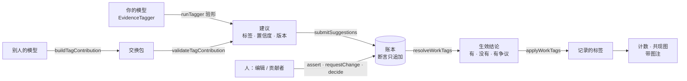
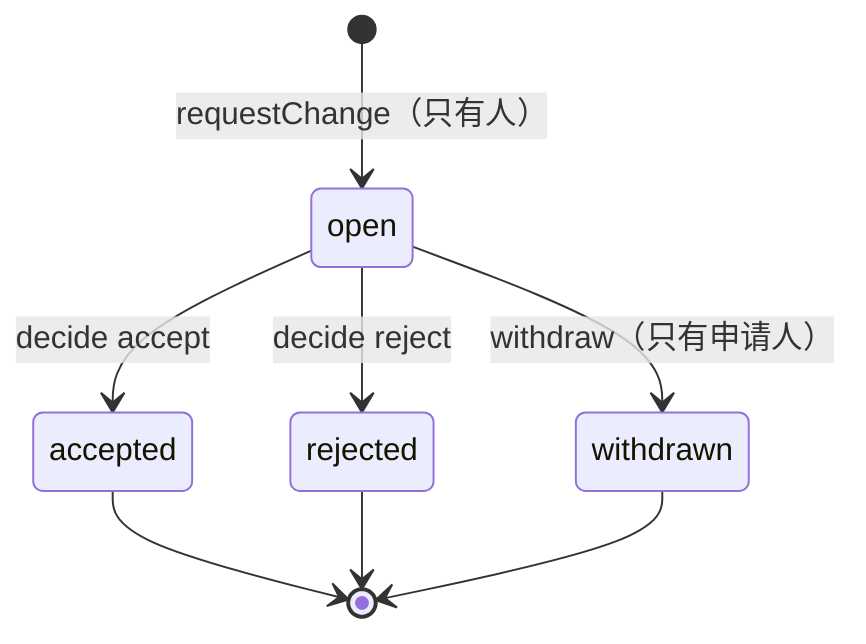

# 打标签与标签账本：模型可以换，结论有章可循

文献按标签分类、计数、画图。标签从哪来、谁说了算、说错了怎么改，是图可不可信的前提。引擎把这件事拆成三块：

| 块 | 回答什么 | 代码 |
|---|---|---|
| 打标签的模型 | 标签从哪来：接入方接自己的模型（大模型、分类器、规则都行），输出一律验形 | `src/tagging.ts` |
| 标签账本 | 多方意见怎么裁决、谁能改、改的流程；只有裁决为「有」的标签进统计 | `src/ledger.ts` |
| 交换包 | 愿意共享的人把自己模型的结果交给托管账本的一方 | `src/tagging.ts` |

引擎只定**规则与形状**，全部是纯函数，零 IO。账号、鉴权、存储、审核界面由接入方托管（见最后一节）。



---

## 1. 接自己的模型

实现 `EvidenceTagger` 就行。引擎不调用任何模型厂商，模型在接入方自己的服务里跑。

```ts
import { runTagger, type EvidenceTagger } from 'scholar-meta'

const myModel: EvidenceTagger = {
  id: 'my-classifier',
  version: '2026-09',            // 进出处：换了版本，新旧结论分得开
  vocabulary: VOCABULARY,        // 受控词表；开放词表给 null
  async tag(doc) {
    const res = await classify(doc.title, doc.abstract)   // 你自己的模型
    if (!res) return null                                  // 失败回 null，不是「没有标签」
    return res.labels.map((l) => ({ tag: l.name, confidence: l.score, rationale: l.reason }))
  },
}

const run = await runTagger(myModel, { work_id: 'openalex:W2741809807', title, abstract }, { minConfidence: 0.3 })
```

`runTagger` 替任何模型把关：

| 规则 | 做法 |
|---|---|
| 标签归一 | 过 `normalizeTag`（全角、大小写、`#`、分隔符），不合法的丢掉 |
| 受控词表 | 词表外的一律丢掉：模型「发明」的标签进不了统计 |
| 置信度 | 夹到 [0, 1]；低于门槛的丢掉；没给的记 null |
| 同一标签多次 | 取置信度最高的一次 |
| 上限 | 缺省每篇 20 个 |
| 模型失败 | 抛错或回非数组 ⇒ 整次回 null |

丢掉了多少、为什么丢，都在 `dropped` 里。

**参考实现** `createVocabularyTagger`：按词表（含人维护的别名）在关键词、外部主题、标题、摘要里找整词（拉丁文按词边界，中日韩按子串）。透明、可复现，适合当基线或冷启动。

| 命中的字段 | 置信度 |
|---|---|
| 关键词 | 0.9 |
| 外部主题 | 0.8 |
| 标题 | 0.7 |
| 摘要 | 0.5 |

---

## 2. 账本：谁说了算

账本里存的是**断言**：谁（人或模型、哪一级）在什么时候说这篇论文「有」或「没有」某个标签。断言只追加，不改不删；改主意就是一条新断言。

`resolveWorkTags` 对每个标签独立裁决：

1. 每个断言者只算**最新**一次立场；
2. 模型的最新立场低于置信门槛 ⇒ 它在这个标签上没有立场（不回退到它更早的结论）；
3. 从最高信任层级往下找，**第一个有人表态的层级说了算**；
4. 这一级有经审核通过的立场（修改申请通过后写入的）⇒ 最近的那条说了算；
5. 否则这一级意见一致 ⇒ 「有」或「没有」；不一致 ⇒ **有争议**。

不投票、不取多数：十个模型一致也压不过一个人，分歧本身就是需要人看的信号。**只有「有」进统计**，有争议的先不计入，图注写明。

| 断言（按时间） | 结论 |
|---|---|
| 模型 A 说有（0.9） | 有（模型决定） |
| ＋ 贡献者说没有 | 没有（贡献者决定） |
| ＋ 编辑甲说有、编辑乙说没有 | 有争议（编辑这一级） |
| ＋ 有人申请去掉，编辑丙审核通过 | 没有（编辑这一级，经审核） |
| ＋ 维护者说有 | 有（维护者决定） |

## 3. 写入闸

`checkAssertion` 决定一条断言能不能直接写：

| 来的断言 | 现行结论 | 结果 |
|---|---|---|
| 层级更高 | 任何 | 直接写 |
| 同级 | 没经审核的 | 直接写（意见不一就成为争议） |
| 同级，附和 | 经审核的 | 直接写 |
| 同级，与之相反 | 经审核的 | 拒绝：`needs_change_request`（再提一次申请，由别人审） |
| 层级更低，附和现行结论 | 有 / 没有 | 直接写（留作支持） |
| 层级更低，与现行结论相反 | 有 / 没有 | 拒绝：`needs_change_request` |
| 层级更低 | 有争议 | 拒绝：`needs_change_request` |

与自己现有立场相同的断言不重复写（`unchanged`）。`unchanged` 只说明立场已在档，不代表现行结论与它一致；结论以 `workTags` 为准。

## 4. 修改申请



| 规则 | 拒绝码 |
|---|---|
| 只有人能申请与审核，模型不行 | `not_a_person` |
| 要有至少一处改动和一段理由 | `empty_request` |
| 论文 id 要认得出 | `invalid_work` |
| 不能审自己的申请 | `self_review` |
| 审核人层级 ≥ 审核门槛（设置 `ledger.reviewTier`），且 ≥ 所涉标签现行结论的层级 | `insufficient_tier` |
| 只处理 open 的申请 | `not_open` |

通过 ⇒ 以审核人的名义为每处改动写一条断言，带上申请 id；驳回不写断言。两种都记下审核人、时间与说明。

**通过即生效**：经审核的立场在它那一级说了算，同级的旧立场（包括原决定人的）不再构成争议；同一级后来又通过的申请覆盖前一个。
经审核的结论，同级不能直接改（写入闸拒绝，要再提一次申请），更高一级可以直接改。
各级内部没经审核的分歧（包括最高一级），可以由当事人改主意来解，也可以提申请、由另一个人审核通过来定。
`presentWorkTags` 给经审核的结论标 `reviewed`，文案写「没有（经编辑审核）」。

## 5. 信任层级：优待自己人

缺省次序是 维护者 > 编辑 > 贡献者 > 模型。**谁是哪一级由接入方在鉴权时决定**，引擎只认传进来的 `actor`：

- 自家编辑放在 editor 或 maintainer，社区贡献者放在 contributor，模型永远在最低一级；
- 次序本身也可以改（`tierOrder`），比如让自家编辑排在社区维护者之上。

| 设置项 | 缺省 | 作用 |
|---|---|---|
| `ledger.modelMinConfidence` | 50（%） | 模型断言的置信门槛 |
| `ledger.reviewTier` | editor | 审核修改申请的最低层级 |
| `ledger.apply` | merge | 结论怎么用到统计上（见第 7 节） |

```ts
import { createLiveSettings, createTagLedger, ledgerPolicyFromSettings } from 'scholar-meta'

const live = createLiveSettings(() => db.pluginSettings.get('scholar-meta'))
const ledger = createTagLedger({
  store: myLedgerStore,                                           // 见第 8 节
  policy: () => ledgerPolicyFromSettings(live.peek().values),     // 后台改了就生效
})
```

## 6. 交换包：愿意共享的人

贡献者在自己的机器上跑自己的模型，把结果打成一个包交上来：

```ts
import { buildTagContribution } from 'scholar-meta'
const pkg = buildTagContribution(myModel, results)   // results: [{ work_id, suggestions }]
```

收包的一方把它当**不可信输入**：

```ts
import { validateTagContribution, presentContributionIssues } from 'scholar-meta'

const v = validateTagContribution(await req.json(), { vocabulary: VOCABULARY, minConfidence: 0.3 })
for (const item of v.items) {
  await ledger.submitSuggestions(item.work_id, item.suggestions, {
    id: `${account.id}/${v.tagger!.id}`,   // 加上贡献者前缀：两个人的同名模型不会被当成同一个断言者
    version: v.tagger!.version,
  })
}
return Response.json({ accepted: v.items.length, issues: presentContributionIssues(v.issues, { locale: 'zh' }) })
```

- 包里**没有层级、没有人的身份**：层级由收包方按鉴权给，包里自称什么一律不信；
- 用**收包方自己的词表**；每包缺省最多 500 篇、每篇 20 个标签；
- 从不抛错：整包不成形、坏的论文 id、重复的论文、没有可收的标签，都逐条报出。

## 7. 结论用到统计上

`applyWorkTags` 在计数与画图之前改记录的标签：

| 模式 | 做法 |
|---|---|
| `merge`（缺省） | 作者原本的标签，去掉账本判「没有」或「有争议」的，加上判「有」的；账本没说的照旧 |
| `ledger_only` | 只用账本判「有」的 |
| `off` | 不用账本 |

记录按 id 找结论，也按 `doi:<doi>` 找。计入的标签里有模型决定的 ⇒ 图注 `model_decided_tags`；有争议的没计入 ⇒ `disputed_tags_excluded`。

服务直接接：`createEvidenceService({ onsite, workTags: ledger })`。标签计数与共现图就按裁决后的标签算，图注自动带上；账本取不到时这次回 `unavailable`，不拿没裁决过的标签凑数。

注意：接了账本以后，`OnsiteArticleSource.listArticles({ tagKeys })` 也要把账本判「有」的标签算进查询，否则只靠账本加上这个标签的文章查不出来。多返回的无妨，服务会再筛一遍。

## 8. 接入方要托管什么

| 东西 | 做法 |
|---|---|
| 存储 | 实现 `TagLedgerStore`：一张断言表（只追加）＋ 一张申请表。建议按 `work_id` 建索引，实现 `listByWorks` 批量取 |
| 鉴权 | 在调用账本之前把登录用户映射成 `actor`（`kind` · `id` · `tier`）。`id` 用内部账号 id，别放邮箱 |
| 写口 | 断言、提申请、审核、撤回、收交换包，全都要鉴权；读者的公开读口不碰账本 |
| 并发 | 同一篇论文的写入串行（或者在存储层加乐观锁）：写入闸是按写之前的结论判的 |
| 大站 | 每次写账本后，把 `workTags(workId)` 的结果物化成一张表；服务的 `workTags` 端口读表，不必每次从断言日志重算 |
| 审计 | 断言与申请都不删；模型断言带 `model_version`，申请带理由与审核说明 |

## 函数一览

| 角色 | 函数 |
|---|---|
| 模型 | `runTagger` · `createVocabularyTagger` · `normalizeWorkId` |
| 交换包 | `buildTagContribution` · `validateTagContribution` |
| 裁决与规则 | `resolveWorkTags` · `checkAssertion` · `openChangeRequest` · `decideChangeRequest` · `withdrawChangeRequest` |
| 门面与存储 | `createTagLedger` · `createMemoryTagLedgerStore` · `ledgerPolicyFromSettings` |
| 用到统计上 | `applyWorkTags` · 服务选项 `workTags` |
| 视图模型 | `presentTagSuggestions` · `presentWorkTags` · `presentChangeRequests` · `presentContributionIssues` |
