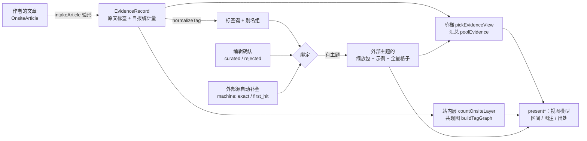

# 标签：怎么用、怎么把它变成可信的图

站内文章的标签是作者随手打的自由文本。把它直接画成图，图的可信度就等于标签的可信度——而自由标签有四种天生的噪声：

| 噪声 | 例子 | 不处理会怎样 |
|---|---|---|
| 写法变体 | `ADHD` / `ＡＤＨＤ` / `#adhd` / `Self-Esteem` 与 `self_esteem` | 同一个话题被拆成几颗球，每颗都显得「研究很少」 |
| 同义、跨语言 | `焦虑` 与 `anxiety`，`焦虑` 与 `焦慮` | 机器硬合并会合错；不合并又看不到全貌 |
| 多义与错配 | `depression`（心理 / 经济）；自动补全给 `adhd` 配上一个相邻主题 | 把别的领域的文献当成这个话题的证据 |
| 长尾与自选 | 大部分标签只用过一两次；站内文章是作者自己选题写的 | 两次偶然同现被画成「强关联」；几十篇站内文章被当成领域全貌 |

（标签系统的这些性质见 Golder & Huberman 2006；频率长尾见 Cattuto, Loreto & Pietronero 2007。）

引擎的做法是**只做可解释、可撤销、可追溯的事**，把判断交给有出处的人，把不确定性印在图上。下面九条原则，每条都对应一段代码与一个测试。

---

## 一条标签走过的路

生产端（左边到中间）在服务端跑；消费端（`present*`）在浏览器里跑。每个环节的两端见 [architecture.md](architecture.md)。

---

## 原则一　归一只做正字法，不做语义（`normalizeTag`）

做：Unicode NFKC（全角→半角、兼容字符，UAX #15）、去零宽与控制字符、去 `#` 前缀、小写、空白 / 下划线 / 各种连字符折成一个空格。

不做：翻译、按语言分支、繁简转换、词干化、同义词合并。这些都是语义判断，机器做错了读者无从察觉；它们交给原则三的编辑绑定。

归一只决定「算不算同一个标签」。**去问外部源时发的仍是原文**（别名组里最常见的写法），不是归一后的键。

## 原则二　别名组：显示名取最常见的原文写法（`groupTags`）

归一后相同的写法归成一组。计数按**记录**去重（同一篇文章打了两遍 `ADHD` 只算一次）；组里每种写法各出现几次都保留，编辑能看到「这个标签实际上被写成了哪几种样子」。

## 原则三　标签到主题是一条带出处的绑定（`resolveTagBinding`）

| 绑定 | 谁定的 | 优先级 | 图上印什么 |
|---|---|---|---|
| `curated` | 编辑确认 | 最高 | 「编辑确认：对应主题 X」 |
| `rejected` | 编辑确认「没有对应主题」 | 最高（否决机器命中，之后不再去问） | 「这个标签没有对应的外部主题」 |
| `machine` · `exact` | 外部源自动补全的候选里有一条，主题名归一后与标签键相同（不论排第几） | 次之 | 「自动匹配（名称相同）」+ `machine_binding` 图注 |
| `machine` · `first_hit` | 候选里没有同名的，取自动补全的第一条 | 次之 | 「自动匹配（未经人工确认）」+ `machine_binding` 图注 |

自动补全是实体链接里的**候选生成**，不是**消歧**（Shen, Wang & Han 2015）：`adhd` 的第一条候选恰好对，别的标签未必——
短词、缩写的第一条常常只是字面上沾边（`app` 的第一条是「Plasma Diagnostics and Applications」）。所以：

- 一次看最多 10 条候选（`MACHINE_CANDIDATE_LIMIT`，自动补全 0 credit），**有同名的取同名的**，没有才取第一条（`pickMachineCandidate`；服务层与 `resolveTopicForTag` 同一个挑法）；
- `resolveTopicForTag` 配上时带 `confidence`（`exact` / `first_hit`）——不用服务层、直接调适配器的接入方也拿得到「有没有把握」；
- 机器绑定永远带图注，并且有三档策略（`machineBinding`）：
  - `first_hit`（缺省）：没有同名的也绑第一条，图注写明未经确认；
  - `exact_only`：只有同名才自动绑，其余进 `needs_review`，**不显示外部文献**，等编辑；
  - `off`：只认编辑绑定。

同义与跨语言（`焦虑` ↔ `anxiety`）的正确做法：编辑把两个标签**各自**绑到同一个主题。这是可追溯（谁、什么时候、为什么）、可撤销的，读者看到的是「编辑确认」。

「没问成」（网络、限流、预算用完）与「查无」是两件事：前者是 `unavailable`，**永不缓存**；后者是 `no_match`，照实缓存。

## 原则四　给绑定找证据：按名字，也按引用（`suggestBindings`）

编辑确认绑定时，引擎给两路**分开列、不合成一个分数**的证据：

1. **按名字**：自动补全的名次，名字是完全相同、部分相同还是不同；
2. **按引用**：带这个标签的站内文章在参考文献里引用的 DOI，它们在外部库里的**主主题**落在哪——例如「40 篇被引文献里 30 篇的主主题是 X（75%，95% 区间 60%–86%）」。

第二路是「按引用关系给文献分类」的思路（Waltman & van Eck 2012）：作者引什么，比作者给标签起什么名字更能说明文章在讲什么。它要求文章申报参考文献 DOI（`OnsiteArticle.references`），每 50 个 DOI 花 1 credit，默认最多查 200 个。区间用 Wilson（原则七）。

## 原则五　跨标签聚合只走人工绑定

主题级（缩小一格）汇总站内文章时，**只汇总编辑绑定到这个主题的标签**。机器匹配只在标签级使用、并且带图注。理由：一次错配在标签级只影响一个标签的页面，在主题级会把错的文章混进一个领域的统计里。

## 原则六　站内与站外分层，不上同一根轴

站内文章是作者自选的（`onsite_self_selected`），外部库是索引全量（带自己的偏差：`recent_years_lag`、`producer_not_population`……）。两者分母口径不同，所以：

- 外部格子在 `EvidenceCountsData.series`，站内格子在 `EvidenceCountsData.onsite` / `EvidenceOnsiteCounts`，**分开下发、分开画**；
- 维度也分两张注册表（`EVIDENCE_DIMENSIONS` 与 `ONSITE_DIMENSIONS`），各自声明互斥与否、分母、图注；
- 外部的「被引最多的 N 篇」只是下钻示例（`sample_not_population`），被引数永不当效应量轴（`NEVER_AS_EFFECT_AXIS`；参见 Leiden Manifesto，Hicks et al. 2015）。

站内层能画而外部层画不了的一张图：**标签 × 研究设计的证据与缺口图**（`crossOnsite`）——哪些话题有随机对照试验、哪些只有横断面、哪里是空白（Snilstveit et al. 2016）。每一行里没申报研究设计的篇数单独给出（`cross_unassigned`），不藏。

## 原则七　比例带区间，小样本不给比例（`stats.ts`、`presentSeries`）

- 百分比**只**用格子声明的分母算，永远不用桶和（多标签维的桶和会超过分母）；
- 每个比例带 Wilson 95% 区间（Wilson 1927；小样本下优于 Wald：Brown, Cai & DasGupta 2001）；
- 分母 < 30 不给比例，只给计数；区间宽度 ≥ 30 个百分点照给但标注。门槛改编自 NCHS 的比例呈现标准（Parker et al. 2017），原标准用 Korn–Graubard 区间，这里换成 Wilson；
- 站内记录少于 30 条时所有站内图都印 `small_corpus`。

## 原则八　共现不是关系；门槛压掉多少要说出来（`buildTagGraph`）

- 边的意思只有一个：两个标签被打在同一篇文章上（`cooccurrence_not_citation`）——不是引用、不是合作、不代表意思相近；
- 支持度门槛（缺省 2）：只出现过一次的共现是噪声；**被压掉几个标签、几条边**写进图注（`collapsed`），不许悄悄不画；
- 三个量都下发：原始共现数（线宽）、Jaccard（Jaccard 1912）、lift＝观察共现 / 独立期望（Brin et al. 1997）。力导向布局用 lift 归一后的关联强度，不用 Jaccard / 余弦——共现数据的归一化应当用关联强度（van Eck & Waltman 2009）；
- 共现图的节点只标**编辑绑定**的主题（原则五）。

这是「共词分析」（Callon et al. 1983）在自由标签上的一个保守版本：只描述结构，不下结论。

## 原则九　作者自报的数字先验形，再决定能画到哪一级

学术类文章的作者可以申报研究设计、结果类型、效应方向、效应量（度量、点估计、95% 区间、样本量、精确 p、数值大是好还是坏）。它们决定证据阶梯（`ladder.ts`，Cochrane Handbook v6.5 ch.10 / ch.12、SWiM）能画到哪一级，所以先过 `intakeArticle`：

- 写反的区间、不含点估计的区间、≤ 0 的比值、|r| > 1、p = 0……清掉并回问题码（`EVIDENCE_INTAKE_ISSUES`），问题可以原样回给作者（`presentIntakeIssues`）；
- 方向与点估计矛盾 ⇒ 方向改为「不明确」、「数值大是好还是坏」清空——谁错了引擎判断不了，就都不拿来画「偏向谁」；
- 没申报方向时按**点估计方向**推（Cochrane 12.2.2.1：按方向计数，不按显著性计票）；
- 自报显著性、p 与区间矛盾只标记（显著性本来就只是标注，不进合成）；
- 汇总菱形另要求同一度量、同一结局方向、同一研究设计、都有区间、≥ 5 项；放行时用 REML 估 τ²、HKSJ 置信区间（q ≥ 1 保守修正）、t(k−2) 预测区间（Viechtbauer 2005；Knapp & Hartung 2003；Röver, Knapp & Friede 2015；Higgins, Thompson & Spiegelhalter 2009；I² 见 Higgins & Thompson 2002）。数值与 scipy 逐个对过。

「阳性率」（多少文章报了显著）在站内有 ≥ 30 篇自报结果类型时可以画，但它是**文献计量**（Fanelli 2010），永远带 `positive_rate_not_efficacy` 图注。

---

## 每种标签视图的可信度清单

| 视图（读口） | 用到的数据 | 必印的图注 | 刻意不做的事 |
|---|---|---|---|
| 标签研究图谱（`/map?tag=`） | 站内记录 + 绑定主题下的外部示例 | 绑定出处；`sample_not_population`；`onsite_self_selected`；`self_reported`；外部层状态 | 不把示例当全体；外部层没接上时不装作这就是全部（`onsite_only`） |
| 标签站内层（`/tags/counts?tag=`） | 带这个标签的站内记录 | 各维度自带的限定；`small_corpus` | 焦点标签不进自己的分布（否则恒等于总数） |
| 标签 × 研究设计缺口图 | 同上 | `self_reported`；`multi_label` | 没申报设计的不塞进任何一列 |
| 标签共现图（`/tags/graph`） | 全站或以某标签为中心的站内记录 | `cooccurrence_not_citation`；折叠数 | 不画低于门槛的边；机器绑定的主题不标 |
| 主题图谱与计数（`/map?level=`、`/counts`） | 外部全量格子 + 编辑绑定标签下的站内层 | 维度注册表里的限定；两个口径的总数 | 站内与外部不上同一根轴；机器绑定的标签不汇总 |

---

## 参考文献

- Brin S, Motwani R, Ullman JD, Tsur S. Dynamic itemset counting and implication rules for market basket data. *SIGMOD* 1997. doi:10.1145/253260.253325
- Brown LD, Cai TT, DasGupta A. Interval estimation for a binomial proportion. *Statistical Science* 2001;16(2):101–133. doi:10.1214/ss/1009213286
- Callon M, Courtial JP, Turner WA, Bauin S. From translations to problematic networks: an introduction to co-word analysis. *Social Science Information* 1983;22(2):191–235. doi:10.1177/053901883022002003
- Campbell M, McKenzie JE, Sowden A, et al. Synthesis without meta-analysis (SWiM) in systematic reviews: reporting guideline. *BMJ* 2020;368:l6890. doi:10.1136/bmj.l6890
- Cattuto C, Loreto V, Pietronero L. Semiotic dynamics and collaborative tagging. *PNAS* 2007;104(5):1461–1464. doi:10.1073/pnas.0610487104
- Fanelli D. "Positive" results increase down the hierarchy of the sciences. *PLoS ONE* 2010;5(4):e10068. doi:10.1371/journal.pone.0010068
- Golder SA, Huberman BA. Usage patterns of collaborative tagging systems. *Journal of Information Science* 2006;32(2):198–208. doi:10.1177/0165551506062337
- Hicks D, Wouters P, Waltman L, de Rijcke S, Rafols I. Bibliometrics: the Leiden Manifesto for research metrics. *Nature* 2015;520:429–431. doi:10.1038/520429a
- Higgins JPT, Thompson SG. Quantifying heterogeneity in a meta-analysis. *Statistics in Medicine* 2002;21(11):1539–1558. doi:10.1002/sim.1186
- Higgins JPT, Thompson SG, Spiegelhalter DJ. A re-evaluation of random-effects meta-analysis. *JRSS A* 2009;172(1):137–159. doi:10.1111/j.1467-985X.2008.00552.x
- Higgins JPT, Thomas J, et al. (eds). *Cochrane Handbook for Systematic Reviews of Interventions*, v6.5. Cochrane, 2024. ch.10, ch.12, ch.24.
- Jaccard P. The distribution of the flora in the alpine zone. *New Phytologist* 1912;11(2):37–50. doi:10.1111/j.1469-8137.1912.tb05611.x
- Knapp G, Hartung J. Improved tests for a random effects meta-regression with a single covariate. *Statistics in Medicine* 2003;22(17):2693–2710. doi:10.1002/sim.1482
- Parker JD, Talih M, Malec DJ, et al. National Center for Health Statistics data presentation standards for proportions. *Vital Health Stat 2* 2017;(175).
- Röver C, Knapp G, Friede T. Hartung-Knapp-Sidik-Jonkman approach and its modification for random-effects meta-analysis with few studies. *BMC Medical Research Methodology* 2015;15:99. doi:10.1186/s12874-015-0091-1
- Shen W, Wang J, Han J. Entity linking with a knowledge base: issues, techniques, and solutions. *IEEE TKDE* 2015;27(2):443–460. doi:10.1109/TKDE.2014.2327028
- Snilstveit B, Vojtkova M, Bhavsar A, Stevenson J, Gaarder M. Evidence & gap maps: a tool for promoting evidence informed policy and strategic research agendas. *J Clin Epidemiol* 2016;79:120–129. doi:10.1016/j.jclinepi.2016.05.015
- Unicode Standard Annex #15: Unicode Normalization Forms.
- van Eck NJ, Waltman L. How to normalize cooccurrence data? An analysis of some well-known similarity measures. *JASIST* 2009;60(8):1635–1651. doi:10.1002/asi.21075
- Viechtbauer W. Bias and efficiency of meta-analytic variance estimators in the random-effects model. *J Educ Behav Stat* 2005;30(3):261–293. doi:10.3102/10769986030003261
- Waltman L, van Eck NJ. A new methodology for constructing a publication-level classification system of science. *JASIST* 2012;63(12):2378–2392. doi:10.1002/asi.22748
- Wilson EB. Probable inference, the law of succession, and statistical inference. *JASA* 1927;22(158):209–212. doi:10.1080/01621459.1927.10502953
